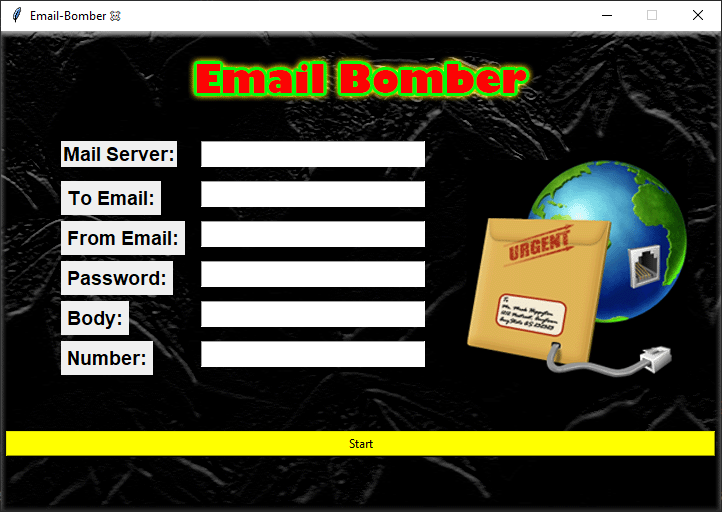

# Email-Bomber-Gui🤩

<p align="center"></p>

## This is a new version to the old [Email-Bomber](https://github.com/Deleted-accounts/Email-Bomber/) and added Gui.

You need to install the tkinter module using this command:
```
pip install tkinter
```
and run the program:
```
python Email_Bomber.py
```
### if you don't have python, You can download it after [convertion to exe](https://github.com/Deleted-accounts/Email-Bomber-Gui/blob/main/Email_Bomber-Gui.exe?raw=true).
### don't forget to download the [background file](https://github.com/Deleted-accounts/Email-Bomber-Gui/blob/main/bg.gif) and paste it in the bomber folder.
 
**Very important! go to https://myaccount.google.com/lesssecureapps end enable it!**

Enjoi
